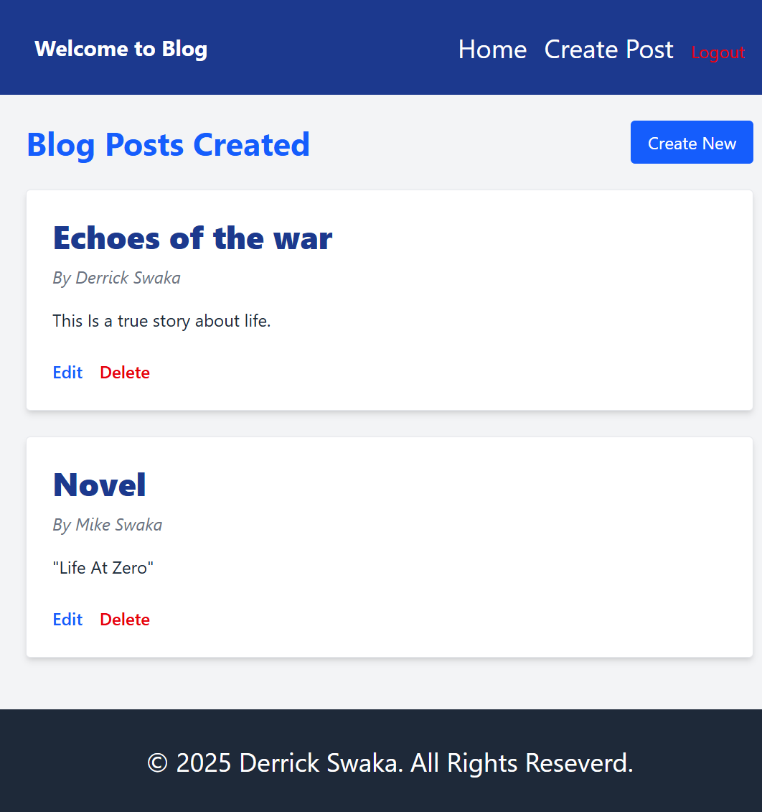

# MERN Blog Application

This is a full-stack blog application built with the MERN stack (MongoDB, Express.js, React.js, Node.js). It features user authentication, blog post creation with image uploads, commenting functionality, and protected routes.

---

## Features

- User registration and login with JWT authentication  
- Create, read, update, and delete (CRUD) blog posts  
- Upload images to blog posts  
- Comment on blog posts: add, edit, delete comments  
- Protected routes: only logged-in users can create/edit/delete posts and comments  
- Responsive design for desktop and mobile  
- Clean and modern UI using Tailwind CSS  

---

## Project Structure

mern-blog/
├── client/ # React front-end
│ ├── public/ # Static files
│ ├── src/ # React source code
│ │ ├── components/ # Reusable components
│ │ ├── pages/ # Page components
│ │ ├── hooks/ # Custom hooks
│ │ ├── services/ # API service functions
│ │ ├── context/ # React context providers
│ │ └── App.jsx # Main app component
│ └── package.json # Client dependencies
├── server/ # Express.js back-end
│ ├── config/ # Configuration files
│ ├── controllers/ # Route controllers
│ ├── models/ # Mongoose models
│ ├── routes/ # API routes
│ ├── middleware/ # Custom middleware
│ ├── utils/ # Utility functions
│ ├── server.js # Main server file
│ └── package.json # Server dependencies
└── README.md # Project documentation


---

## Getting Started

### Prerequisites

- Node.js (v14 or higher recommended)  
- MongoDB instance (local or cloud e.g. MongoDB Atlas)  

### Installation

1. Clone the repository

```bash
git clone <your-repo-url>
cd mern-blog

2.Install dependencies for both client and server

pnpm install
pnpm --filter client install
pnpm --filter server install

3.Create .env files in both /server and /client (if needed) with environment variables

### Example for server .env

PORT=5000
MONGO_URI=your_mongodb_connection_string
JWT_SECRET=your_jwt_secret

4.Run the development servers concurrently

pnpm run dev

<Frontend will run on http://localhost:5173/ (Vite default)

<Backend will run on http://localhost:5000/

## Usage

1.Register a new user or login with existing credentials

2.Create new blog posts with optional image upload

3.View list of blog posts on the Home page

4.Click a blog post title to view details and comments

5.Add, edit, and delete comments on posts

6.Edit or delete your own blog posts

Technologies Used

1.React.js with React Router and Tailwind CSS

2.Node.js with Express.js

3.MongoDB with Mongoose ODM

4.JWT for authentication

5.Axios for HTTP requests

6.Nodemon and concurrently for development

Future Improvements

1.Add pagination or infinite scroll to blog list

2.Enable rich text editing for blog content

3.Enhance image upload with progress bar

4.Add user profiles and avatar uploads

5.Deploy to cloud hosting platforms

## 📸 Screenshots

### Homepage


### Blog Detail Page


### Blog with Comment


### Login Page


### Homepage View 2



Author
Derrick Swaka

Thank you for checking out my MERN blog app! Feel free to reach out for any questions.
Email: derrickswaka910@gmail.com


